# Accessibility

## Opening accessibility inspector

1. open development tools by pressing f12.
2. click on the accessibility tab in the developer tools.

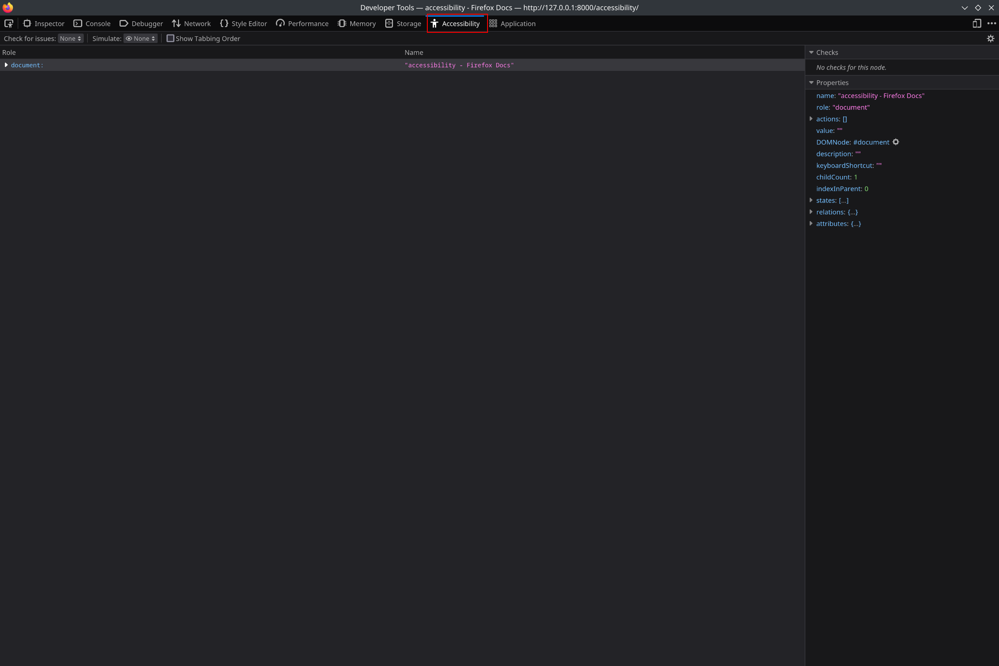

## Enabling color simulation

1. [open accessibility inspector](#opening-accessibility-inspector)

2. click on the simulate menu

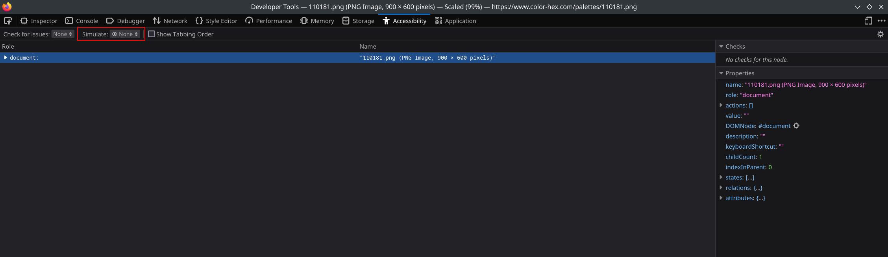

3. click on the desired color simulation

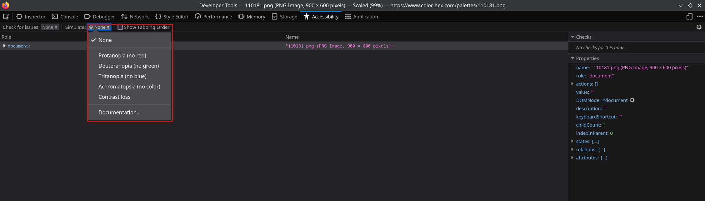

## Color simulation examples

The accessibility tab can simulate various color blindness situations.

- normal color image

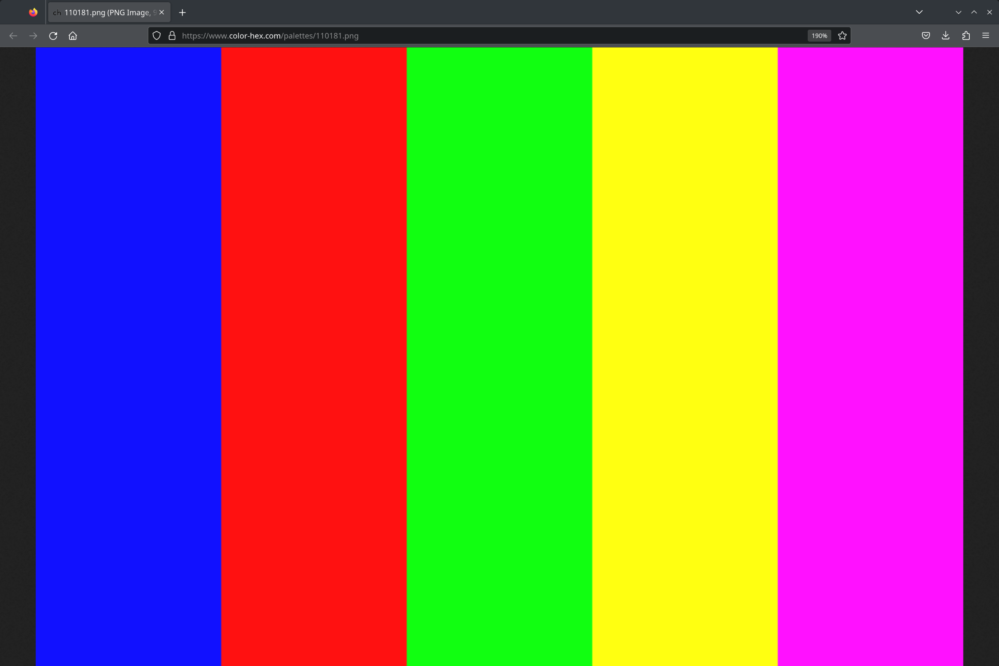

- image with protanopia (no red)

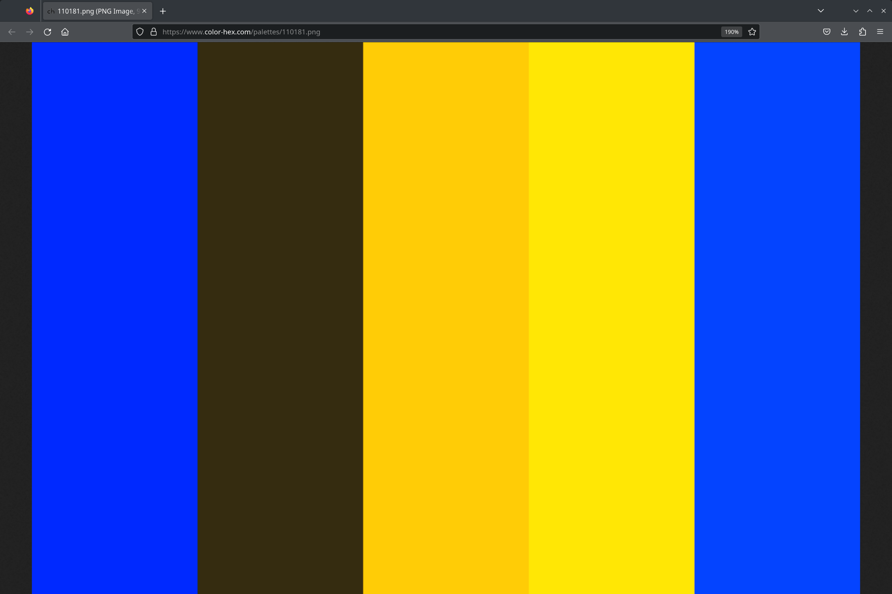

- image with deuteranopia (no green)

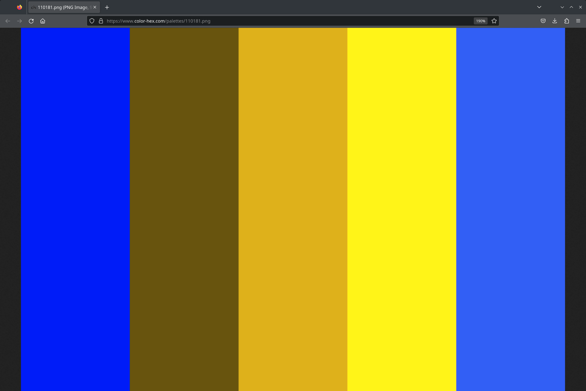

- image with Tritanopia (no blue)

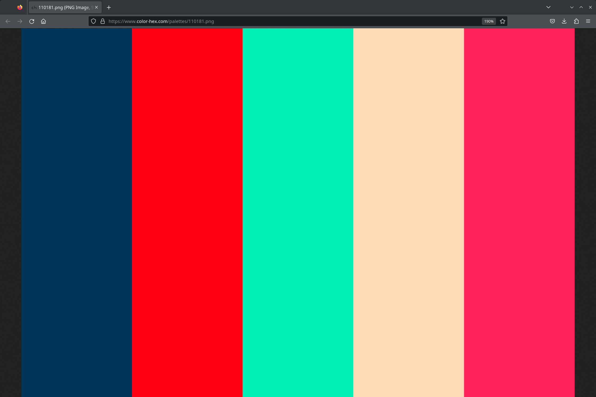

- image with Achomatopsia (no color)

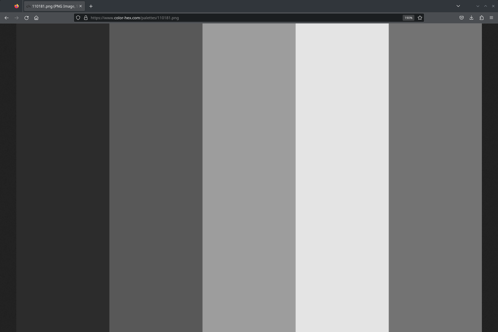

- image with Contrast loss

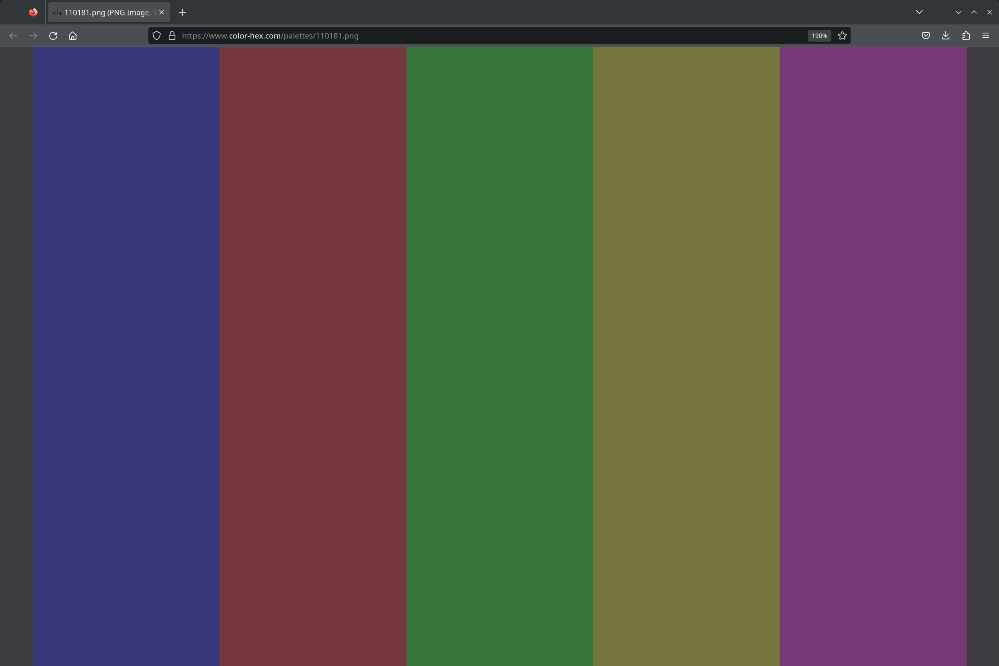

## Tabbing order

You can check how a user will tab through your site if they are using a keyboard for navigation by checking the Show tabbing order toggle. Each element that can be tabbed to will show a number representing how menu tabs it will take to get to that element.

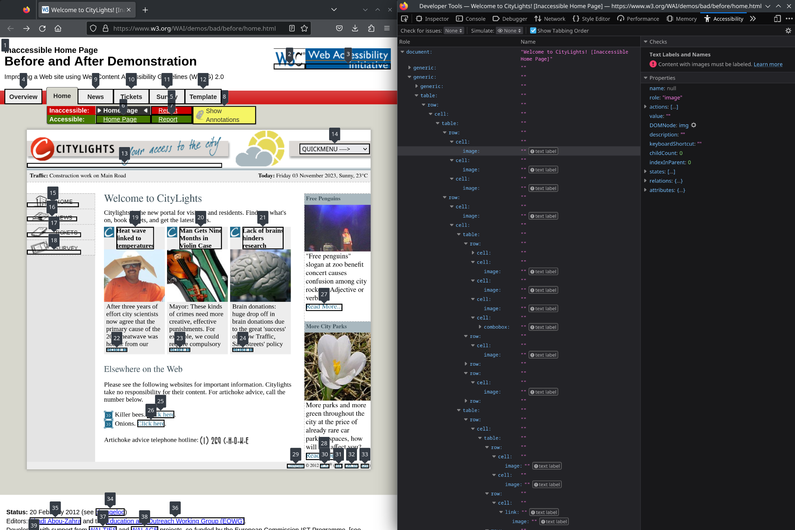

## Accessibility Inspector

Here you can inspect the documents structure and see places in the web page that don't follow accessibility guidelines.

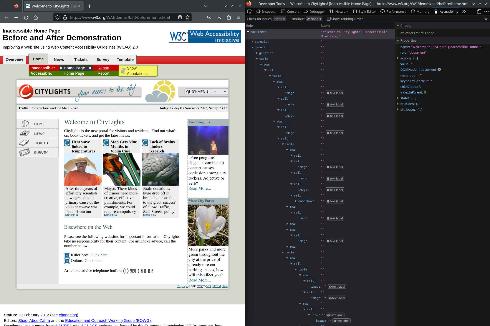

- You can filter the inspector to show different kinds of accessibility issues.
	+ contrast
	+ keyboard
	+ text labels
	+ all issues

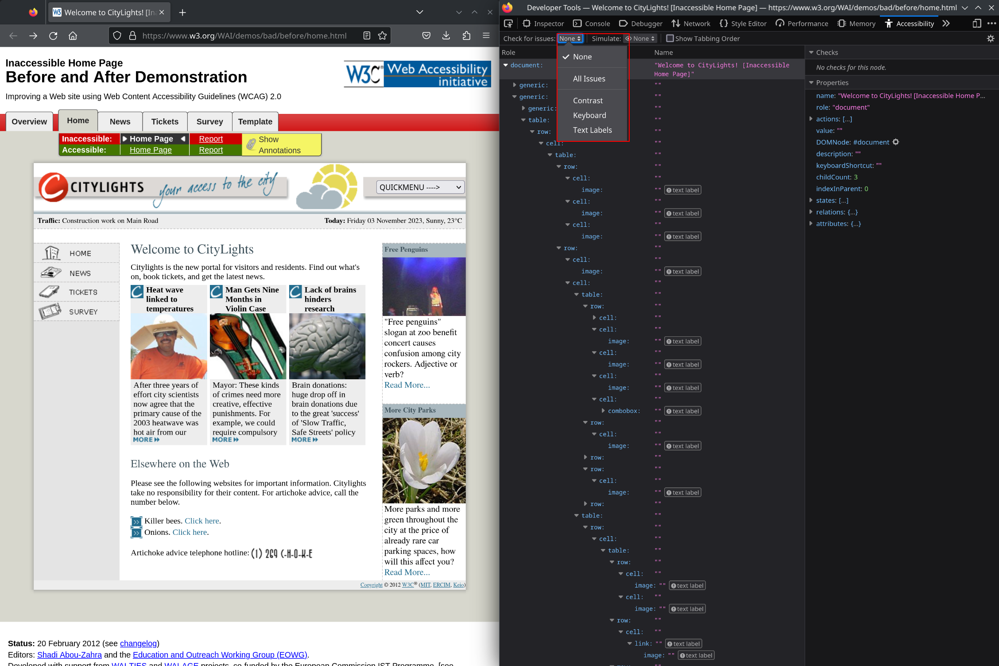

- checks shows if the selected item in the inspector has a issue and a link to learn more about the specific issue and recommended ways to fix the accessibility issue.

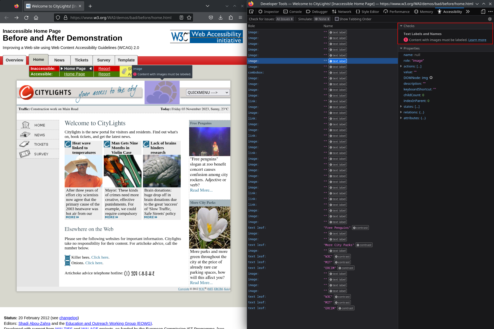

## See also

For more information on web accessibility:

- [Mozilla web accessibility documentation](https://developer.mozilla.org/en-US/docs/Web/Accessibility)
- [World Wide Web Consortium Accessibility introduction](https://www.w3.org/WAI/fundamentals/accessibility-intro/)
- [World Wide Web Consortium Accessibility guidelines](https://www.w3.org/TR/WCAG22/)