# Console

The Firefox JavaScript Console is a developer tool that allows you to interact with and debug JavaScript code in web pages. It allows you to write code snippets and test their output. It also displays error messages, warnings and log messages. 

## Getting Started

To launch the console in Firefox, right click and select "inspect" on the pop up window. 

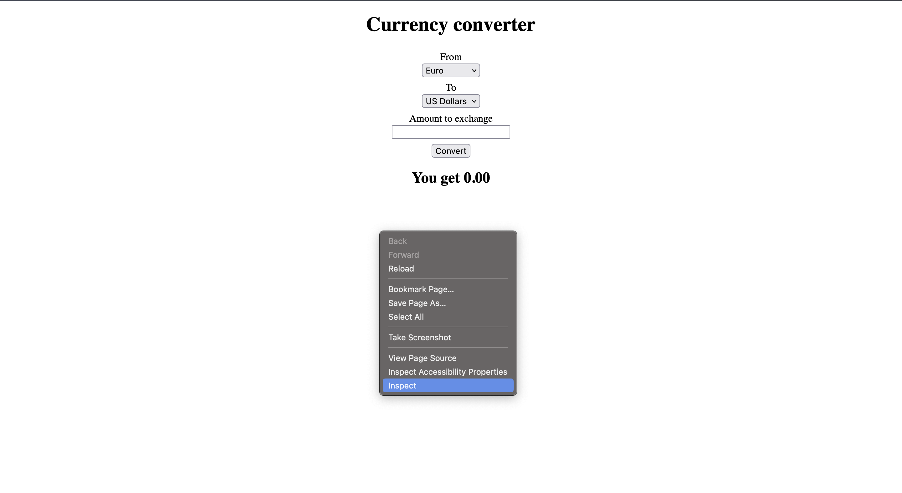

The following window will pop up:

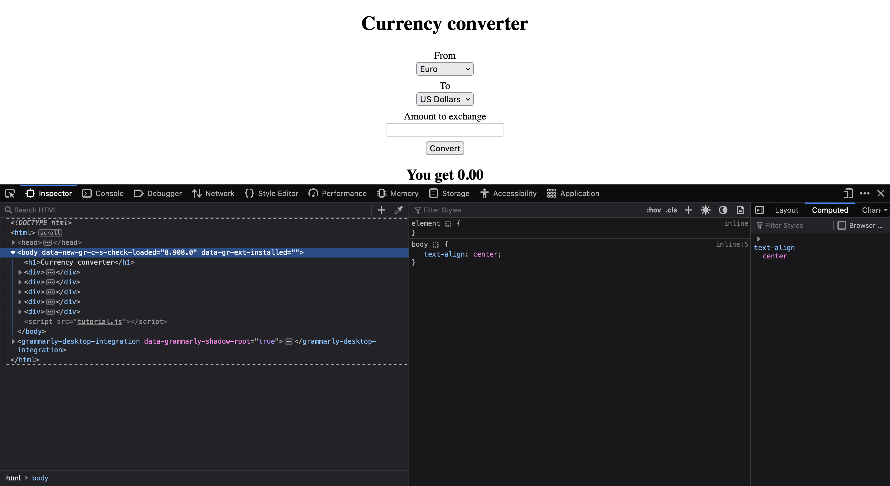

From this window, select "console" highlighted in red. You can then begin writing JavaScript by typing next to the ">>" in red. 

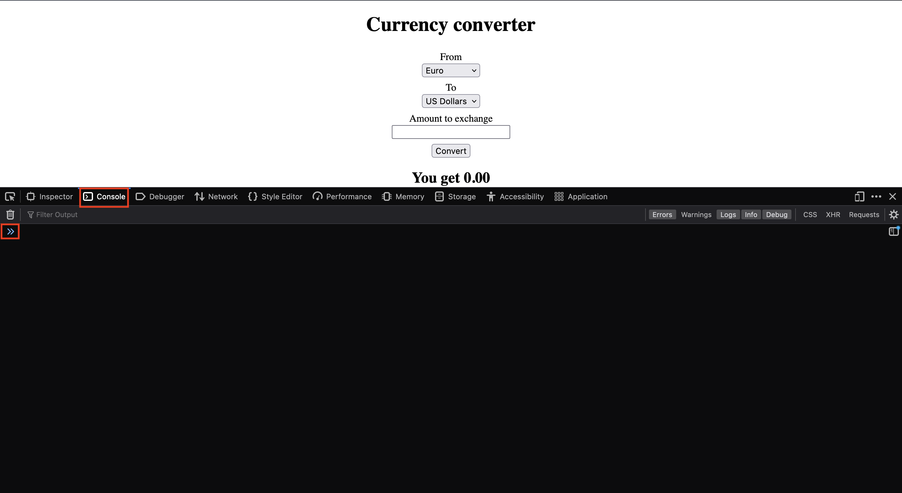

## Writing Code Snippets

To write a code snippet, simply type any JavaScript code in the text box of the console. Notice how the value of both variables are displayed.

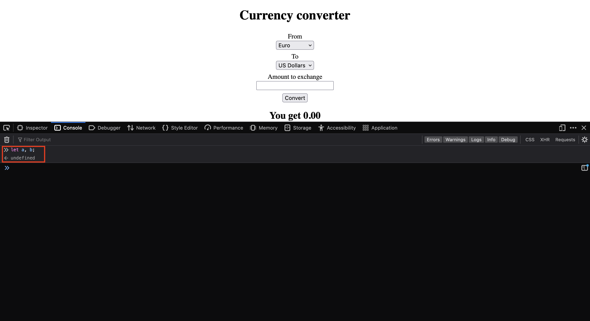

Once the variables are defined, their values are updated.

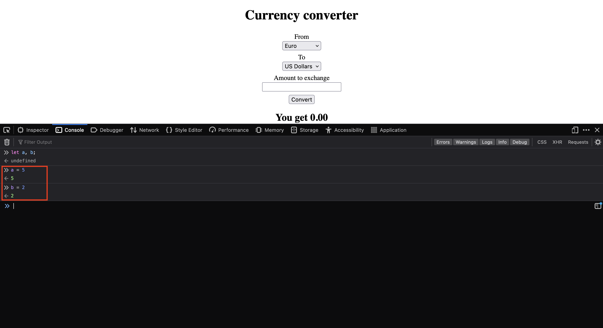

Any variable created in the console can be used to create any type of expression

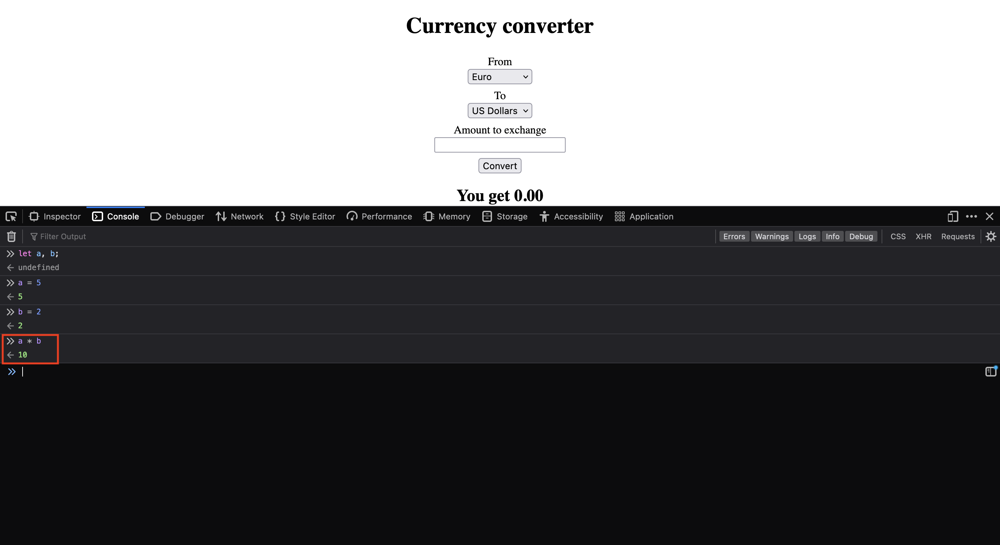

## Creating HTML Elements

Using the console, you can test how HTML elements added to the page via JavaScript will interact with the page. When typing JavaScript into the console, any command can be autocompleted by selecting the desired command and typing "Tab". 

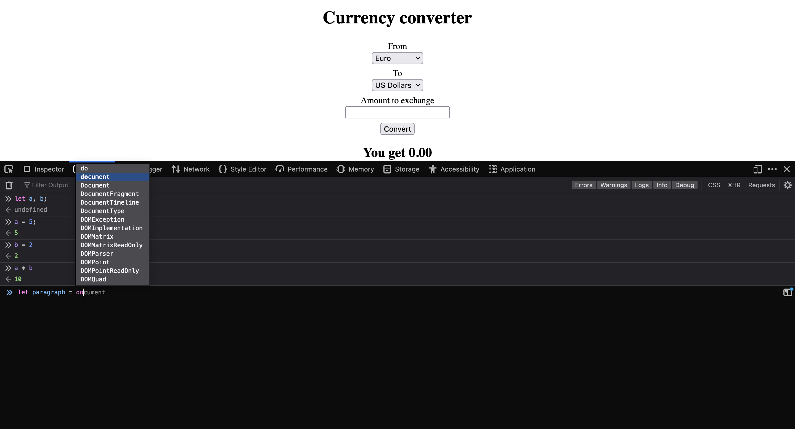

Here is an example of adding a paragraph element to the DOM

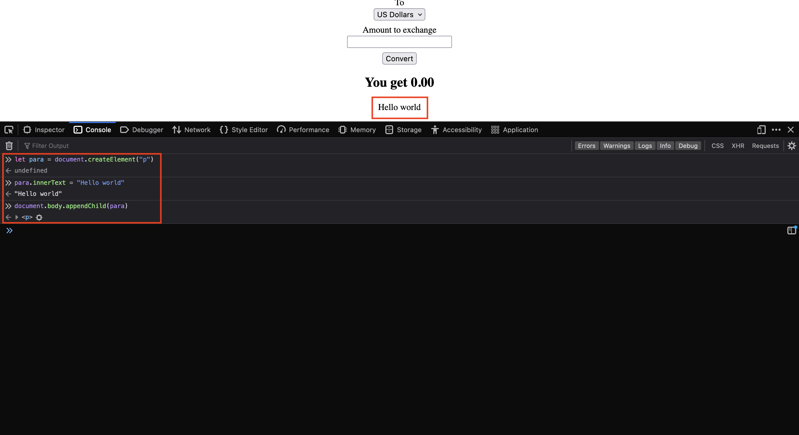

## Testing JavaScript Functions

You can also call JavaScript functions defined in the web page and pass in custom values. Below is the JavaScript code from the website: 

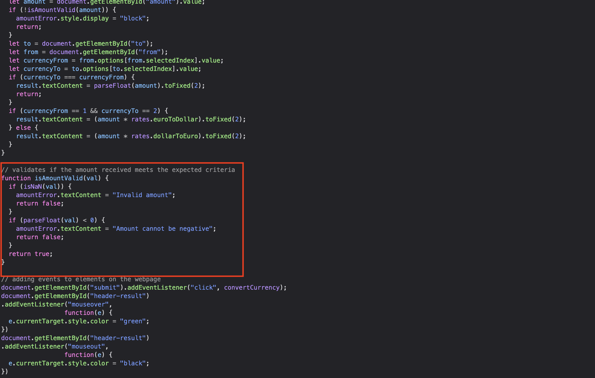

Here is an example of testing a function called "isAmountValid()" which tests whether the input is a number or not. 

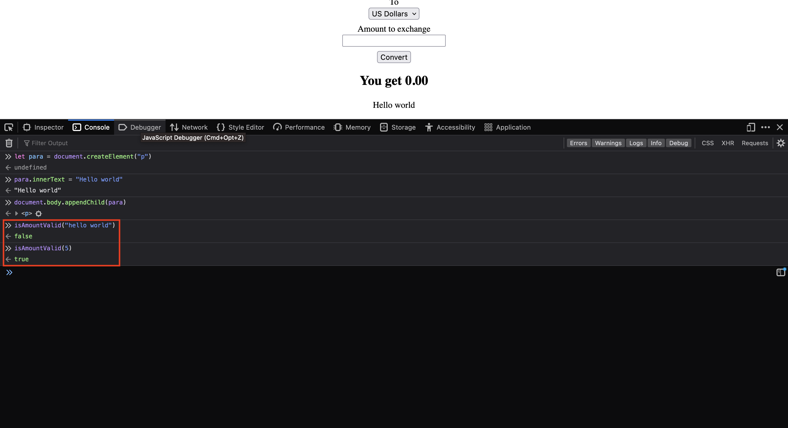

## Error Messages

Any errors with JavaScript code will appear in the console. These errors will have an error message and give the precise line the code crashed. 

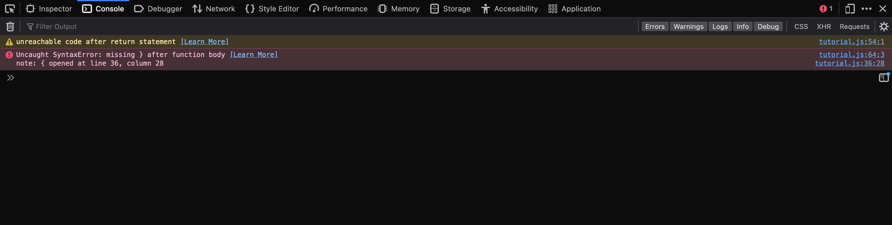

When clicking on the line the code crashed, the code will be opened in the debugger. To learn more about the debugger,  [open the debugger page](debugger.md)