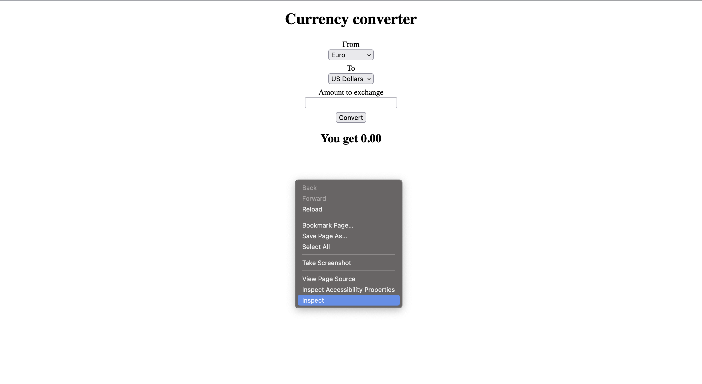
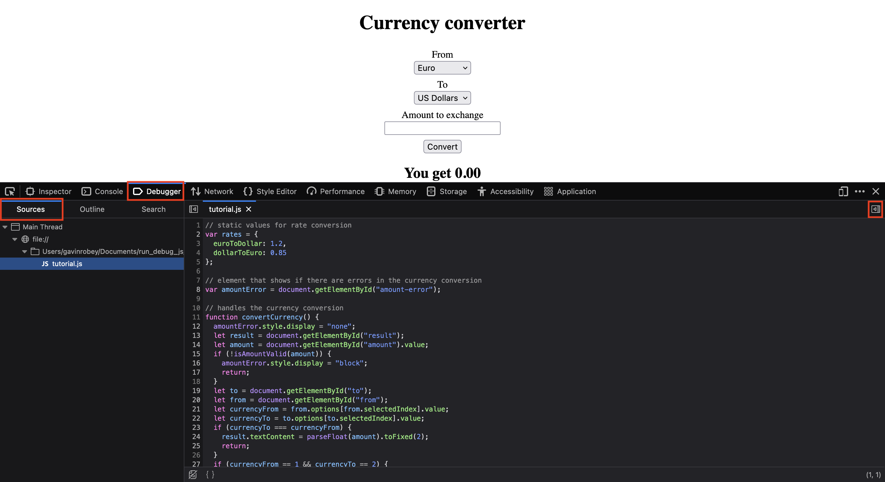
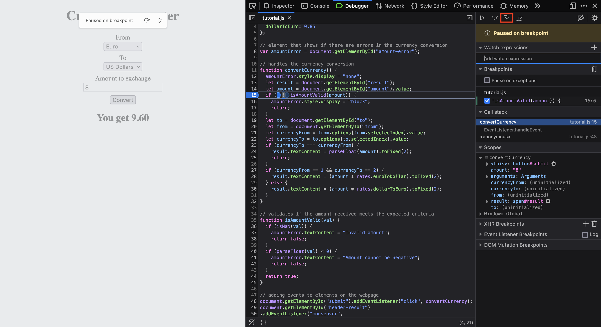

# Debugger Tools

The Firefox debugger is a robust tool for web developers, providing a wide range of features to help identify, analyze, and fix issues in web applications, making the development and debugging process more efficient and effective. The Debugger contains the following features: 

- **Code Debugging:** The primary purpose of the debugger is to help developers find and fix issues in their JavaScript code. You can set breakpoints in your code, pause execution at specific lines, and inspect the values of variables to understand how your code is behaving.

- **Stepping Through Code:** You can step through your code execution line by line, allowing you to understand the flow and identify the exact location of bugs or unexpected behavior.

- **Live Editing:** Firefox's debugger allows you to modify your code while debugging through the watch expressions tool. This is particularly useful for quick testing and experimentation.

- **Variable Inspection:** You can inspect the values of variables at different points in your code execution, helping you identify issues with variable values or data manipulation.

- **Call Stack and Call Hierarchy:** You can view the call stack to understand the path your code took to reach the current point. This helps in tracking the flow of function calls. Firefox also provides a call hierarchy feature, which allows you to explore the calls to and from a specific function.

- **Event Listener Breakpoints:** You can set breakpoints on specific DOM events or XMLHttpRequest calls, making it easier to catch issues related to event handling.

- **Console Interaction:** You can interact with the browser console directly from the debugger, which is useful for executing ad-hoc JavaScript commands or checking the output of your code.

- **Error Handling:** The debugger highlights and helps you understand JavaScript errors, making it easier to locate and resolve them.

## Getting Started

To start debugging Javascript in Firefox, right click and select "inspect" on the pop up window. 

The following window will pop up:

From this window, select "debug" highlighted in red, then "sources" where you can select any Javascript files used in your website. To open all debug tools, select the drawer icon on the right of the window highlighted in red.

## Setting Breakpoints 

To set a breakpoint, click on the line of code you want to test. Then run your Javascript code by interacting with your website. This will trigger any events written in your Javascript file. Once the breakpoint is triggered, the exact line of the breakpoint is given, the call stack of all functions triggered by the event, and the scope of the current function is highlighted in red. 

Inside the scope section, the arguments of the current function can be expanded to show its arguments and their types, its name, length, and any functions that called it. All functions involved in the calling of this function are displayed and their arguments are all displayed as well. 

Inside the scope section, there is also a global scope drop down menu that displays all functions available in scope to the current line, and all global variables and their values. 

## Stepping Through Code

Once a breakpoint is set, you can step through code line by line and view how each component interacts with each-other. To step through your Javascript file, click the arrow on the upper right corner highlighted in red. Below is a simple demonstration of stepping through a logic gate. Notice how the value of "val" in the scope section is 8. 

Since "val" is a number, the next line executed is 40.

However, when "val" is not a number, the next line executed is 37.

Once you are done stepping through your Javascript file, click the play button in the upper right corner highlighted in red to resume normal execution. 

## Step Into and Out of Functions

To step into a function, click on the arrow highlighted in red. 

This will jump into the first line of the function selected. To step out of a function select the arrow highlighted in red. 

## Event Listener Breakpoints

Breakpoints can also be created from events triggered in your program. For example, any mouseover event can specifically be targeted and create a breakpoint. This is incredibly useful for tracing what events trigger what functions in Javascript. To create an event listener breakpoint, go to the "Event Listener Breakpoint" drop down, and check the box of the event to be targeted. 

When the event is triggered, the lines of Javascript code that handled the event are highlighted. The DOM element that triggered the event can also be viewed by clicking the target button in the scope section highlighted in red.

## Watch Expressions

You can also watch the values of a given variable or expression throughout the execution of your program using the "Watch Expressions" drop down menu. To access this menu click on the drop down menu and click on the "add watch expression" text box in red. In here you can type the name of a variable and write any expression you wish. Then select a breakpoint and step through the program. 

Notice how the value of "amount" goes from "unavailable" to "810" when stepping through the program. This is because at the first breakpoint, "amount" isn't added to the DOM yet. Once it's added, its value is retrieved. 

<i>by Gavin Robey</i>

