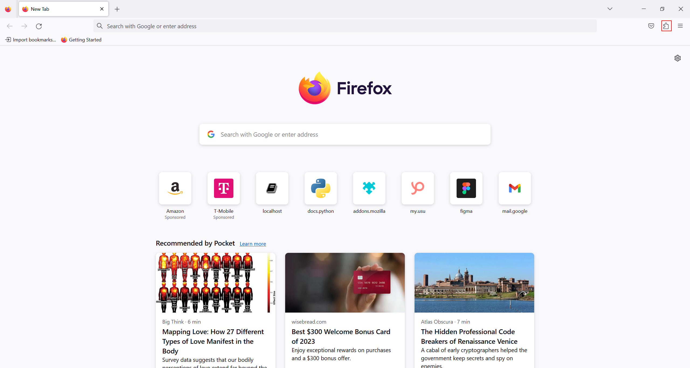
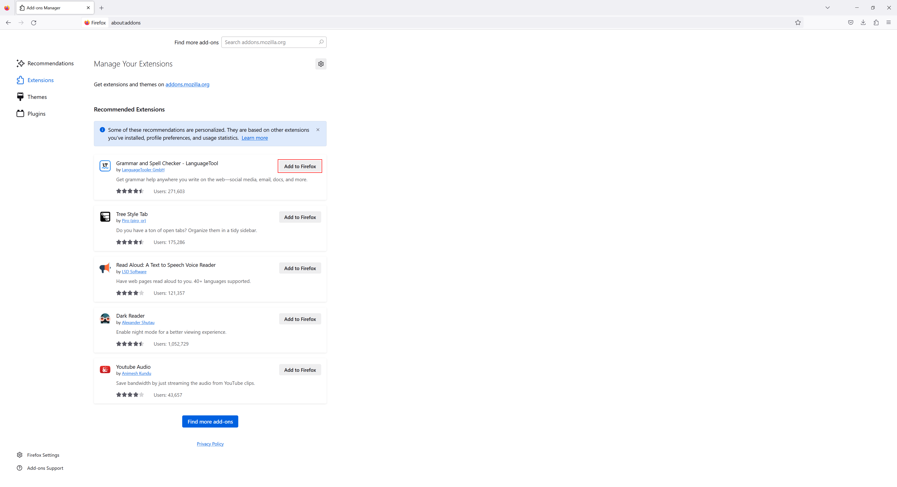
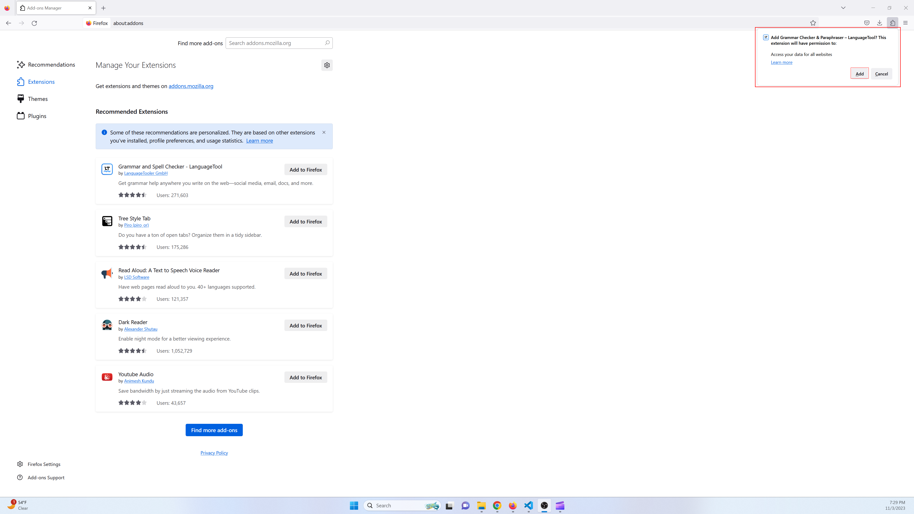
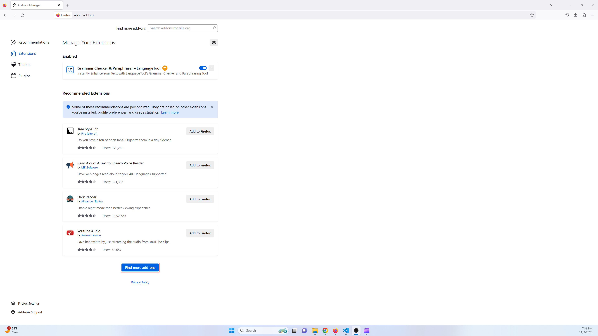
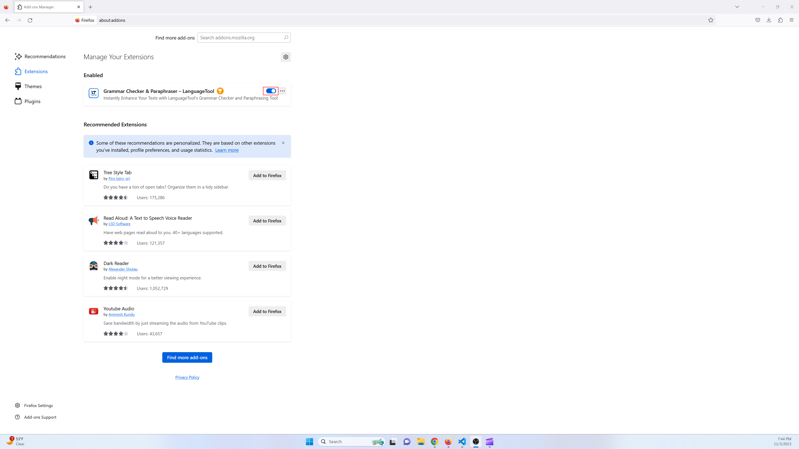

# Extensions

## What are firefox extensions?

Extensions are small software programs that can enhance your browsing experience. Extensions usually do at least one of the following.

- Extend or enhance some sort of functionality
- Make tasks easier
- Allow for more personalized customization
- Improve Privacy and Security
- Use for games and entertainment 

This page focuses on how to add, access, use, and remove firefox extensions. By the end of this section of documentation you will be able to effectively use an extension.

## Accessing extensions

There are two main ways to navigate to the extensions page.

- Click the hamburger icon to the right of the searchbar (near the top right of the browser). Then click settings. From the settings page click "Extensions and Themes" near the bottom left corner of the page.

<video style="width:100%; padding-bottom: 24px;" muted="" controls="" alt="type:video">
   <source src="..\videos\extensions_v1.mp4" type="video/mp4">
</video>

- Click the extensions icon near the top right corner of the browser.

## How to add an extension
From the exensions page you can add a recommended Extension by clicking the "Add to Firefox" button next to the extension you would like to add. 

Then the extensions asks for certain permissions in a popup. Click "add" to finish adding the extension.

Most the time the extension you want won't be found under recommended extensions. To search for an extension go to [https://addons.mozilla.org/en-US/firefox/extensions/](https://addons.mozilla.org/en-US/firefox/extensions/).

You can also navigate to the site by clicking the  "Find more add-ons" button from the extensions page.

From the addons site you can search for an extension by clicking on a category or by searching for one with the searchbar.

<video style="width:100%; padding-bottom: 24px;" muted="" controls="" alt="type:video">
   <source src="..\videos\extensions_v2.mp4" type="video/mp4">
</video>

Once you find the extension you want click the "Add to firefox" button and click "add" on the permissions popup like we did earlier on in this section.

## Using an extension
Since each extension provides a different feature using each extension may be slightly different. You should easily find resources about each extension online. Don't panic, extensions are generally simple and easy to use.

I've already downloaded the "Grammar Checker & Paraphraser – LanguageTool" extension. Using it is super simple.

Just navigate to somewhere on your web browser you type text. In this example we will use the extension to help write an email using Gmail.

Go to gmail and start writing a new message. When grammar suggestions are found they will be accessable by clicking a dot that appears near the bottom right. This shows a pop up modal you can use to easily apply desired suggestions.

<video style="width:100%; padding-bottom: 24px;" muted="" controls="" alt="type:video">
   <source src="..\videos\extensions_v3.mp4" type="video/mp4">
</video>

## Edit an extension
Go to the "Manage Your Extensions" page.

Find the extension you want to manage. Click the toggle if you desire to enable/disable the extension.

Click on the 3 dots icon and then "options" to go to the extensions settings page. From this page you can edit any of the setting shown on the page.

<video style="width:100%; padding-bottom: 24px;" muted="" controls="" alt="type:video">
   <source src="..\videos\extensions_v4.mp4" type="video/mp4">
</video>

## Removing extensions
Removing an extension is simple.

1. Got to the "Manage Your Extensions" page.
2. Find the extension you want to remove and click on the 3 dots icon.
3. Click "remove"
4. Confirm deletion by clicking the "Remove" button presented in the pop up modal.

<video style="width:100%; padding-bottom: 24px;" muted="" controls="" alt="type:video">
   <source src="..\videos\extensions_v5.mp4" type="video/mp4">
</video>
