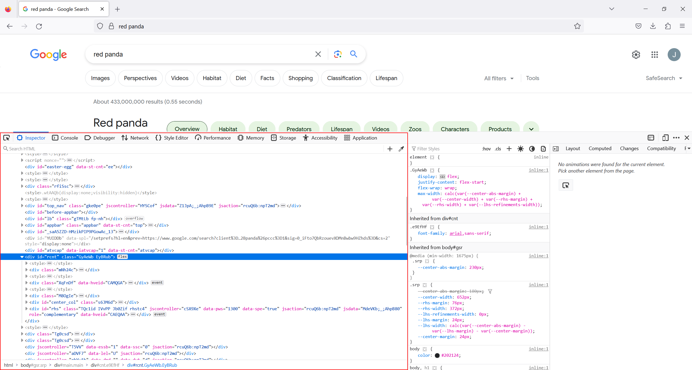
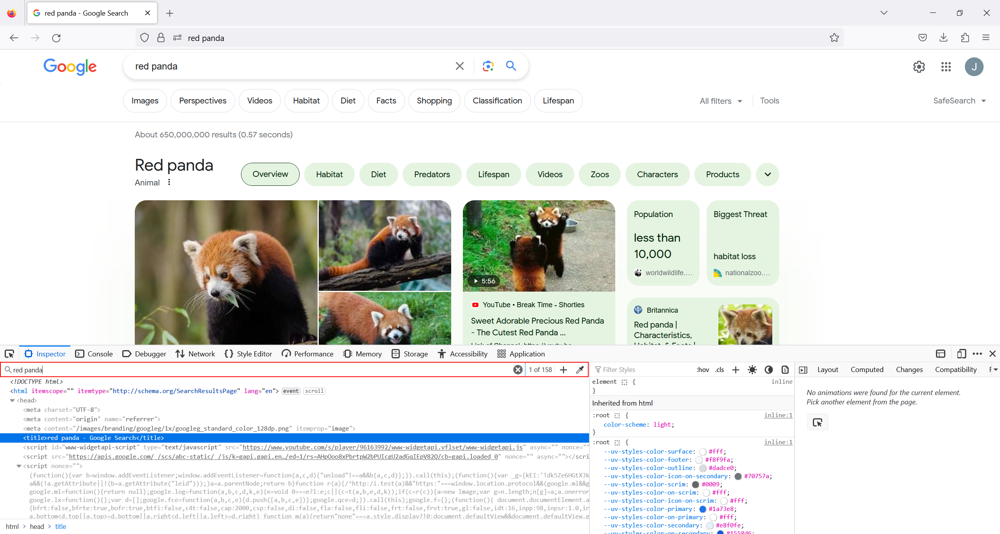
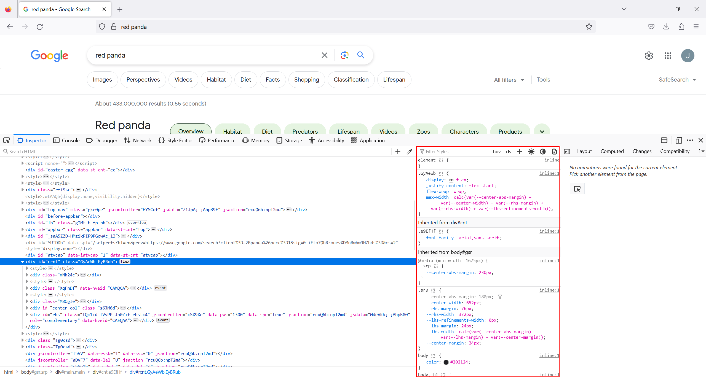
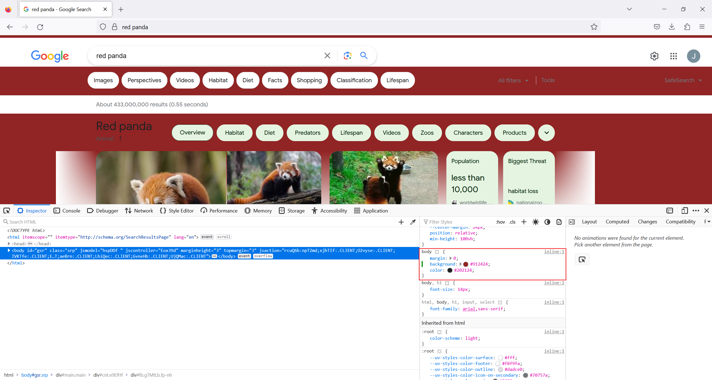
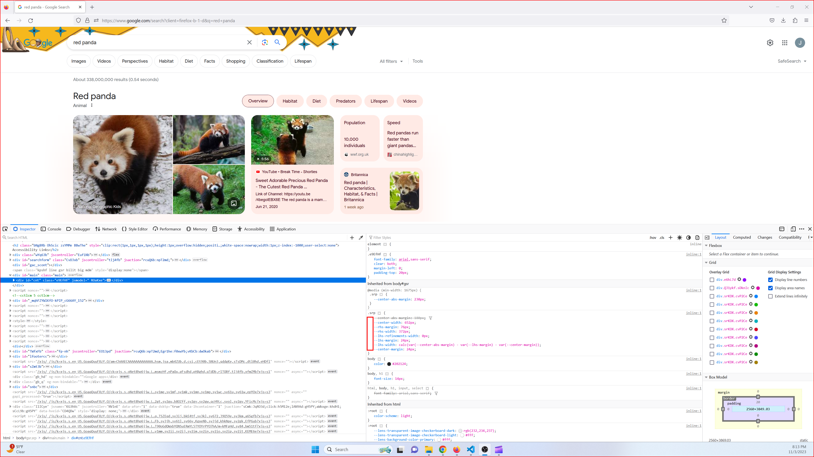
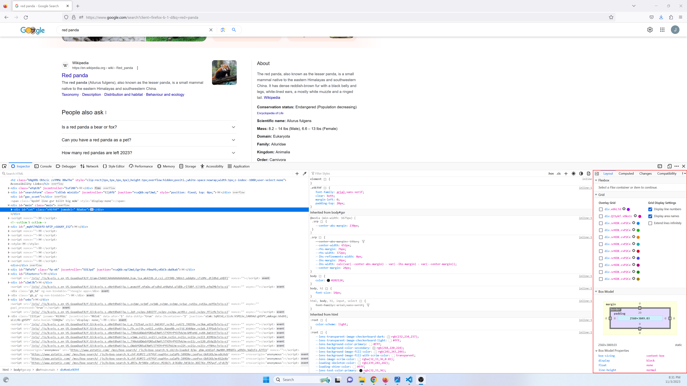
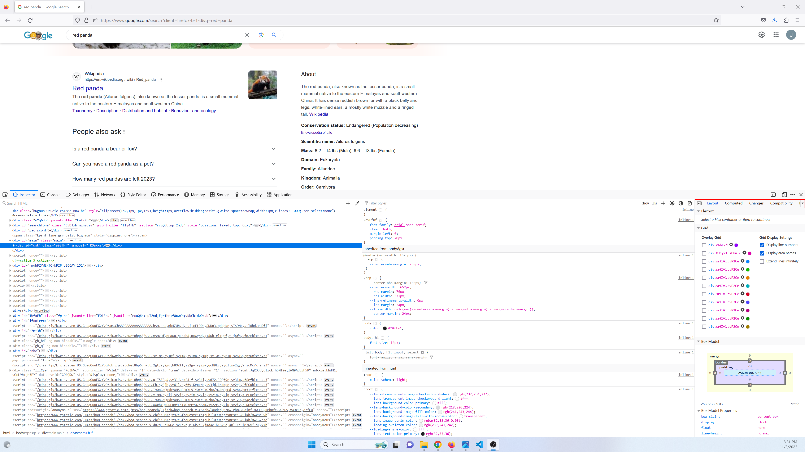

# Inspector

## What is the inspector
Inspector is a powerful tool and is frequently used during front end web development. The inspector tool is composed of many smaller tools. We will focus on the most used inspector tools. By the end of this chapter you will be able to navigate your way around the inspector tool.

## How to open the inspector

There are 2 main ways to open the inspector

- Click hamburger icon to the right of the searchbar. (near the top right of the browser) Then click More Tools > Web Developer Tools. The keyboard shortcut for this is ctl + shift + I

<video style="width:100%; padding-bottom: 24px;" muted="" controls="" alt="type:video">
   <source src="..\videos\inspector_v1.mp4" type="video/mp4">
</video>

- Right click on an html element and then click inspect. This opens the inspector with the element selected in the html pane. The keyboard shorcut for this is ctl + shift + C

<video style="width:100%; padding-bottom: 24px;" muted="" controls="" alt="type:video">
   <source src="..\videos\inspector_v2.mp4" type="video/mp4">
</video>

## HTML pane
The Inspector pannel is divided into 3 panes. In this section you will learn how to use the html pane. The html pane is highlighted in the image below.

You can use this pane to view the html of the current webpage. While viewing the html you can click the ▼ next to an element to expand it and see its children. Clicking the ▲ will collapse the element hiding all of its children.

If you wish to easily find a specific dom element you can use the element finder tool. This is located at the top left of the pane. First click on the finder icon (in the left corner of dev tools) and then click on the element you wish to select from the UI.

<video style="width:100%; padding-bottom: 24px;" muted="" controls="" alt="type:video">
   <source src="..\videos\inspector_v3.mp4" type="video/mp4">
</video>

If you wish to search for an element by something other than than the UI you can use the searchbar located near the top of the pane. You can search for specific text on the page, specific css classes or element ids. After typing in your query you can repeately click enter to scroll through the results.

While using the inspector tool you can temporarily change anything in the html file. Changes will be reflected on the UI until the page is reloaded. This can be used to test small changes and when debugging the user interface.

## Rules pane
The rules pane is located to the right of the html pane. It shows all the css classes that apply to a selected element on html pane. These classes include ones that are specified on the element as well as all the inherited classes.

You can make changes to the styles and all changes will be reflected in the UI until reload. For example, we can inspect a webpages body tag and then apply a red background to it.

We can also toggle specific rules by clicking the checkbox that appears next to a style on hover.

Various tools are located at the top of the pane. We can use the filter bar to search for specific rules. Clicking :hov allows us to toggle specific psuedo classes and .cls to toggle classes. The plus button next to those can be used to start generating a new rule. The sun and moon icons can be clicked to switch between light and dark mode. Keep in mind not all websites have a theme defined for dark mode so this may not always appear to do much. Clicking the last icon will change the UI to reflect how it will look when printing the screen.

## Layout Pane
The layout pane can be used analyse the different grid layouts used on the page as well as the flex and box model of the selected dom element.

## Other features
You can turn the Layout pane into one of many other tools. These are all inspector tools but used less frequently. This section gives a brief summary of what each does.

Computed: This tool shows the computed styles for the selected html element. These are the final values applied by the browser.

Changes: This shows all of the applied css changes applied from the rules pane.

Compatability: Shows compatability issues on different versions of different browsers.

Fonts: Shows all the fonts used on the page and allows you to edit some font properties.

Animations: Can be used to view and anaylse any animations applied on the selected element.
