# Network Tab

## Disable the Cache

### Why Disable the Cache

Disabling the cache has multiple benefits while testing the network behavior of web applications.

- Ensures that all resources are downloaded over the network for each request instead of
being loaded from cache.
- Allows for more accurate measurements of worst-case load times.
- Ensures that if a bug is introduced by a new version of an application, that bug
is not overlooked because the old version's resources are loaded from cache instead
of the new resources.

### How to Disable the Cache

To disable the cache:

1. Open the Firefox developer tools. This can be done in a few different ways:
    1. Use the keybinding Control-Shift-I.
    2. Use the hamburger menu at the top right.
        1. Click on the hamburger menu

            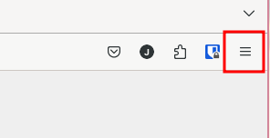

        2. Select "More tools"

            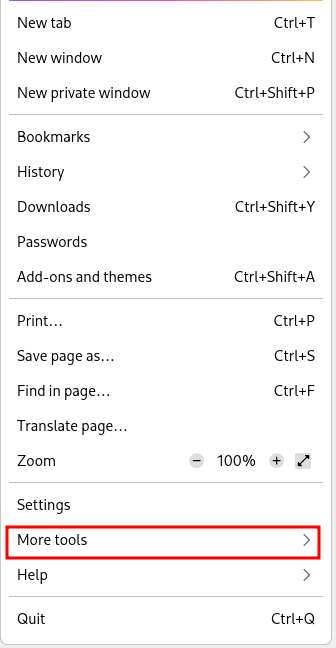

        3. Select "Web Developer Tools"

            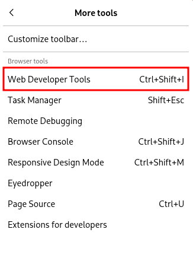

2. Navigate to the Network Tab.
    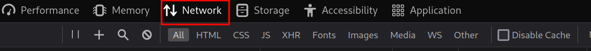
3. Check the "Disable Cache" box.
    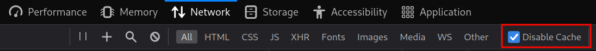

## Filter Requests

### By File Type
 
To filter requests by filetype:  

1. Open the Network tab in the developer
tools (if you don't know how to do this, refer to the section "Disable the Cache").
2. Just underneath the tab bar there is a bar full of widgets, find the section
that lists filetypes (shown below).
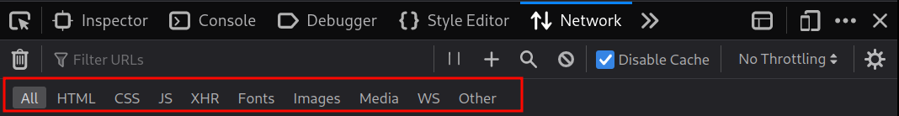
3. Select the filetype(s) that you wish to filter for.

### By Other Fields

To filter requests by fields other than filetype (for example domain name):  

1. Open the Network tab in the developer
tools (if you don't know how to do this, refer to the section "Disable the Cache").
2. Just underneath the tab bar there is a bar full of widgets, find the search bar
that says "Filter URLs".
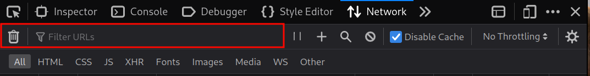
3. Type in your filter term, this search is somewhat intelligent meaning that it
will match even partial URLs.

## Measure Network Performance

There are a few different tools within the Network tab that allow a developer to
measure network performance, the usage of a few of these tools is listed below.

### Performance Analysis

To launch the performance analysis tool:

1. Open the Network tab in the developer
tools (if you don't know how to do this, refer to the section "Disable the Cache").
2. At the bottom left of the Network tab there is a stopwatch icon, click this to
launch the performance analysis tool.
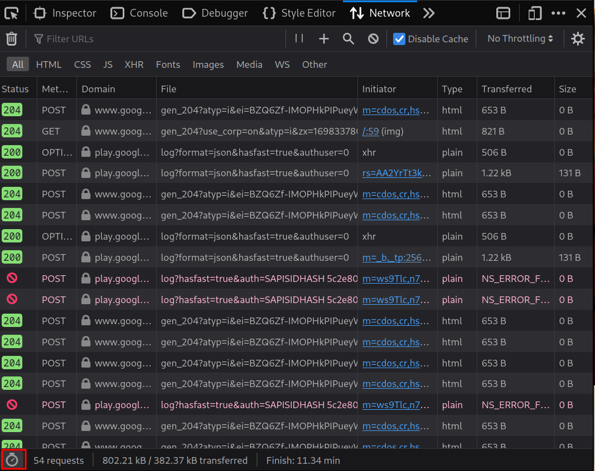
3. Once the performance analysis tool has launched, Firefox will re-load the web
page that is under testing and then display network statistics both with cache enabled
and with cache disabled.

<figure>

<figcaption align = "center">Performance analysis tool cache enabled section.</figcaption>
</figure>

<figure>

<figcaption align = "center">Performance analysis tool cache disabled section.</figcaption>
</figure>

There are a lot of statistics given within the performance analysis tool, a few
of these are shown below for quick reference:

- Full webpage statistics including total download size and total download time.
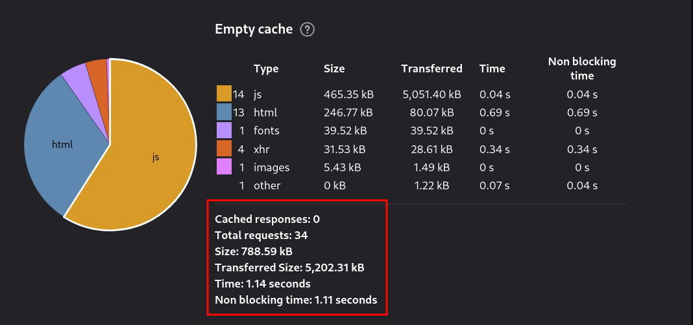
- The download sizes and download times of individual filetypes.
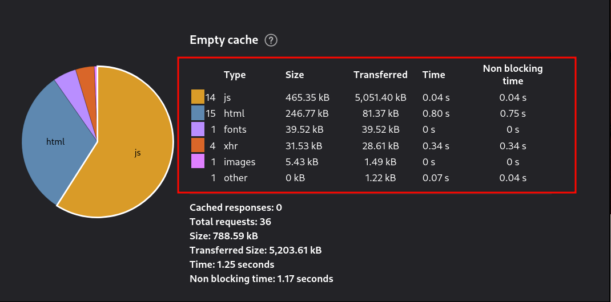

### Network Throttling

To select a level of network throttling:

1. Open the Network tab in the developer
tools (if you don't know how to do this, refer to the section "Disable the Cache").
2. In the upper right corner of the Network tab there is a dropdown menu that
says by default "No Throttling".
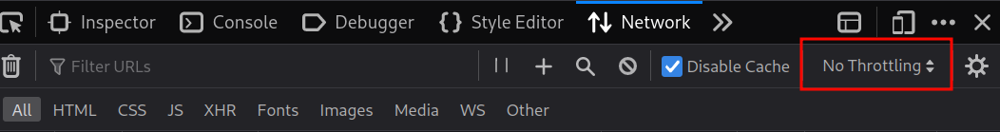
3. Click on this dropdown and select a level of throttling appropriate for your testing needs.
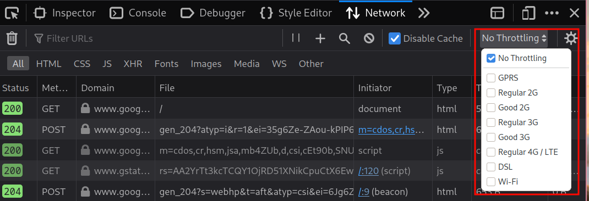

## Block Requests

### From the Request Blocking Section

To block requests using the request blocking section:

1. Open the Network tab in the developer
tools (if you don't know how to do this, refer to the section "Disable the Cache").
2. To the right of the "Filter URLs" searchbar (location shown above in the "Filter Requests: By Other Fields" section)
there is a group of icons that includes a slashed circle. Click on the slashed circle to open the request blocking section.
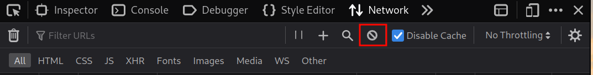
3. Once the request blocking section is open, ensure that the check box labeled "Enable Request Blocking" is checked.
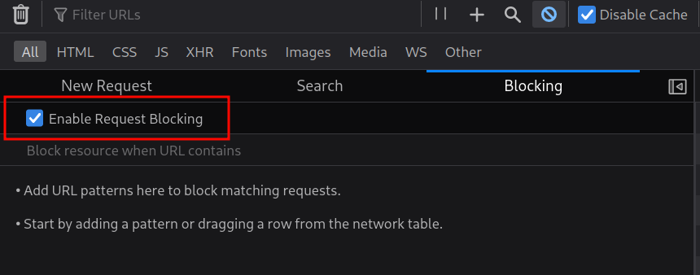
4. Directly below the "Enable Request Blocking" checkbox is a text field that says
"Block resource when URL contains", type your blocking filter into this box and hit enter.
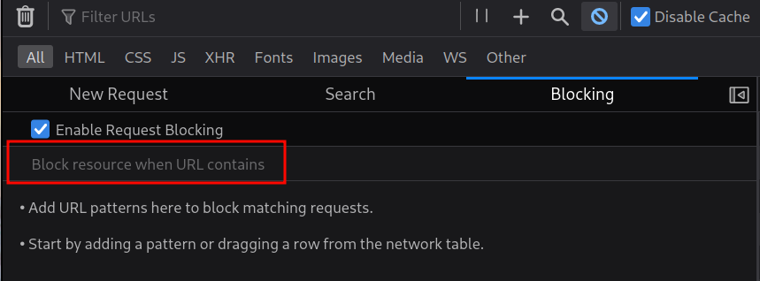
5. If you would like to un-block a request after previously entering it into the
request blocking filter, you can uncheck the box next to that filter in the list
above the text field.
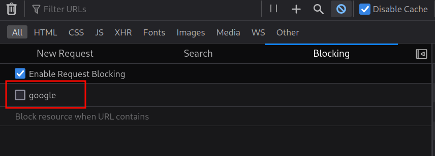

### From the Request List

It is also possible to block requests from the request list view:

1. Open the Network tab in the developer
tools (if you don't know how to do this, refer to the section "Disable the Cache").
2. The request list view appears by default directly below the tabs and widgets.
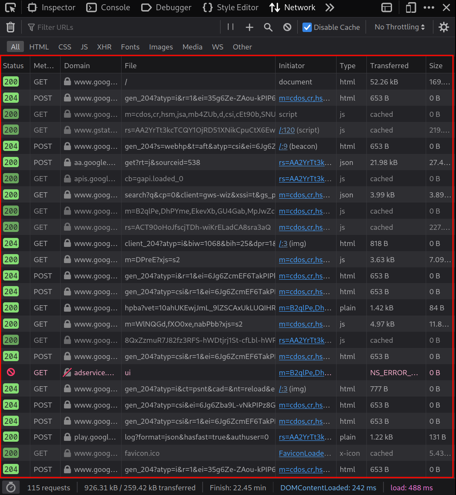
3. Right-click on any request in the list and select "Block URL" from the context menu.
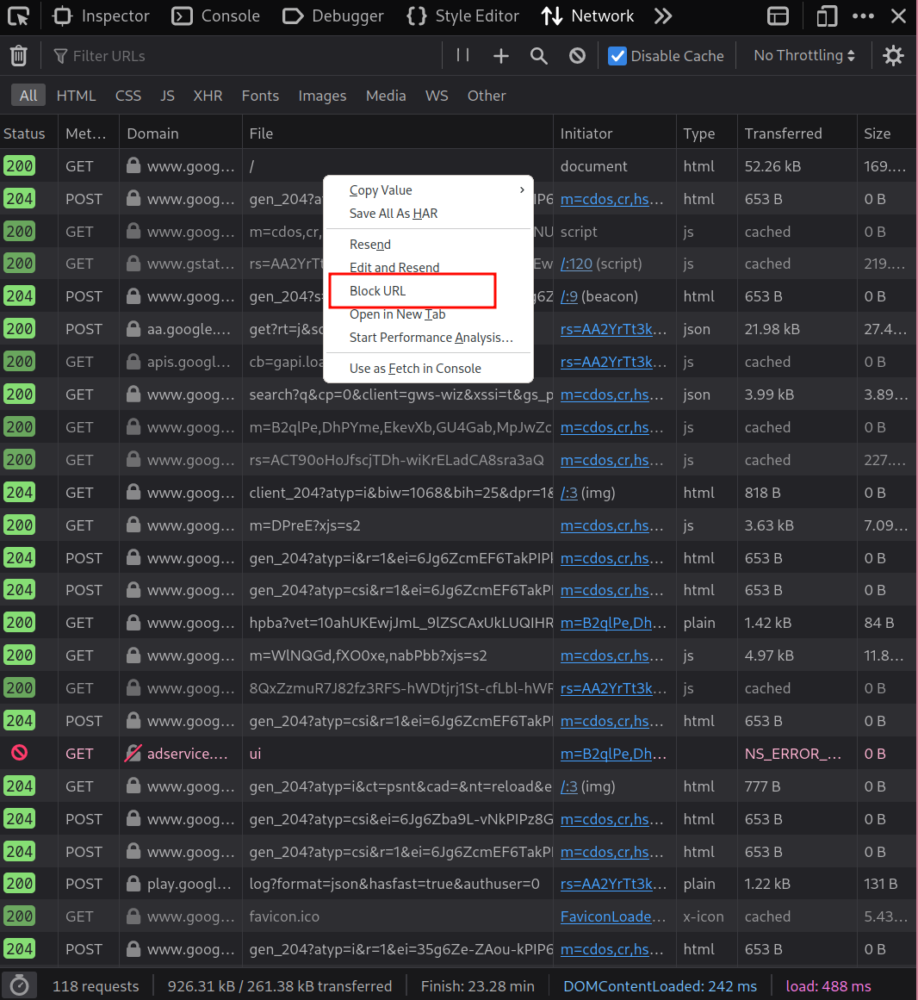

