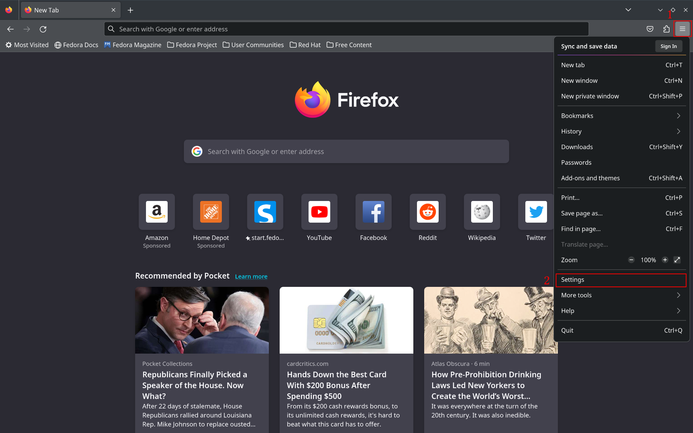
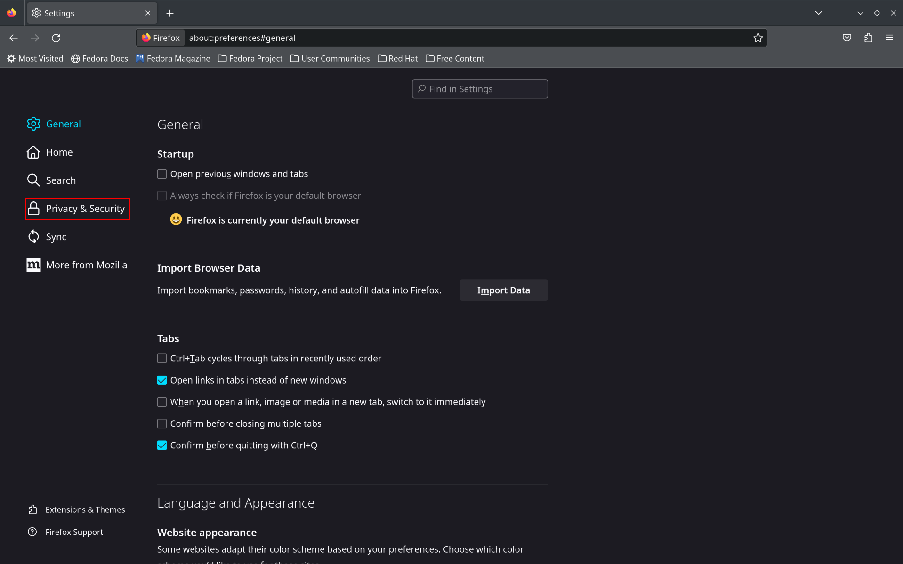
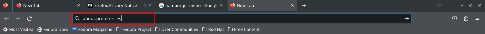
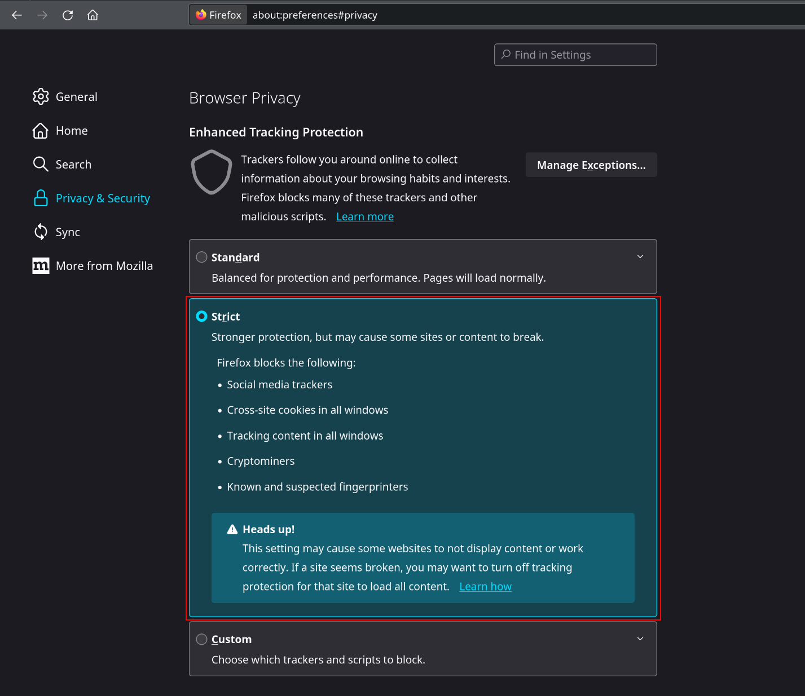
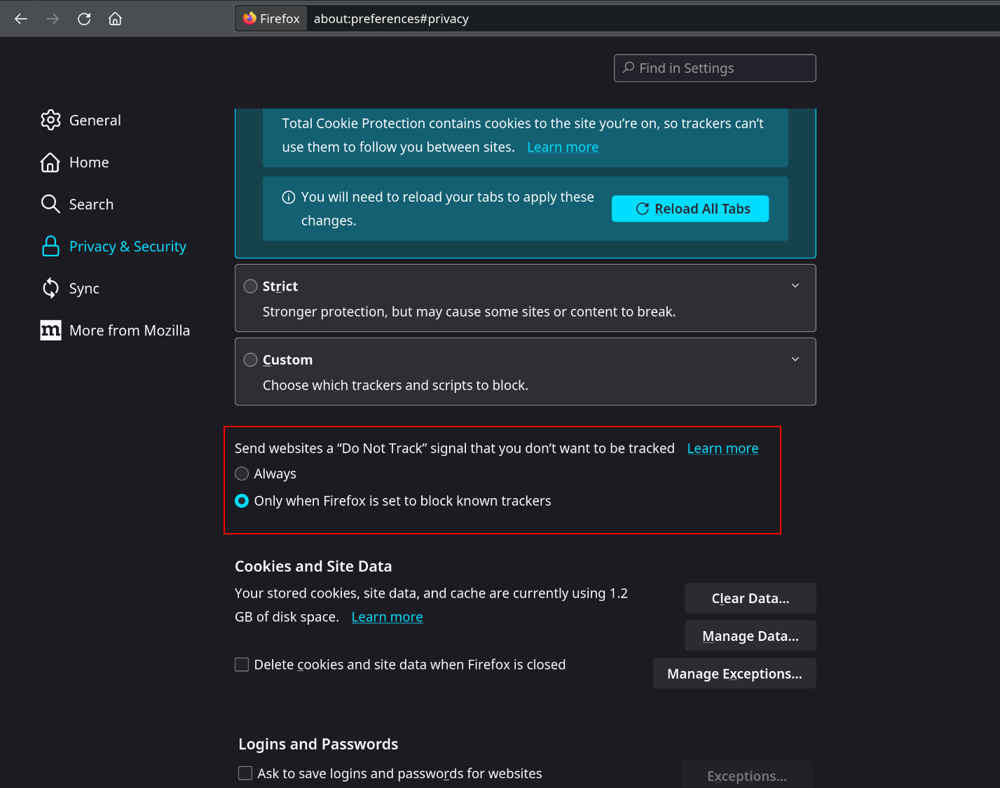
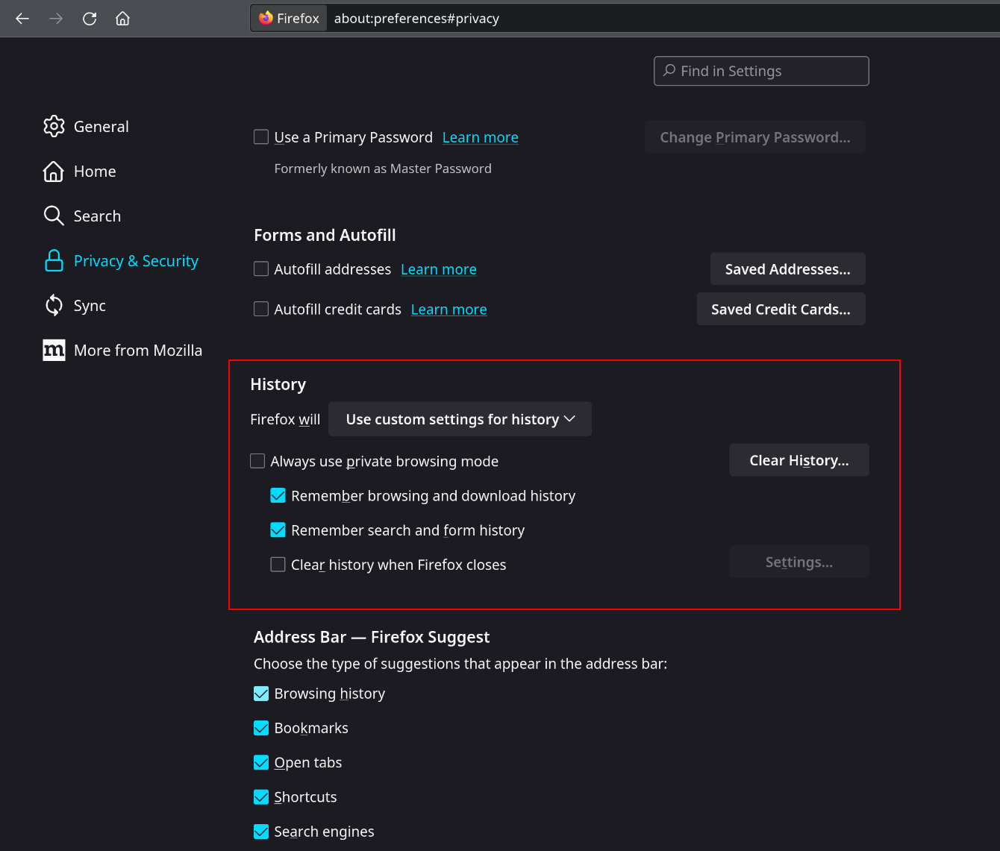
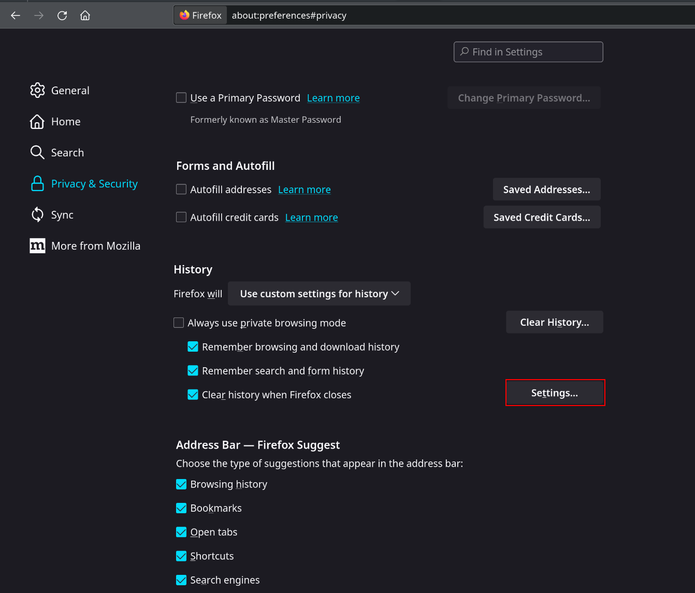
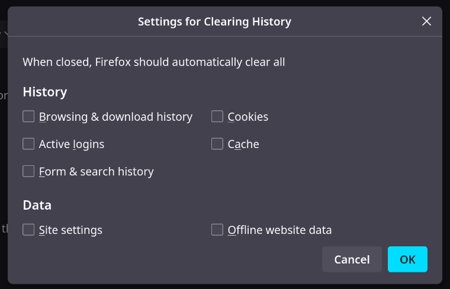
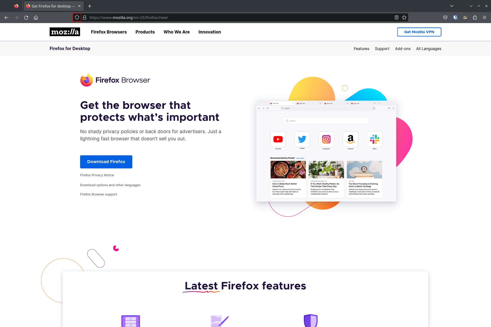
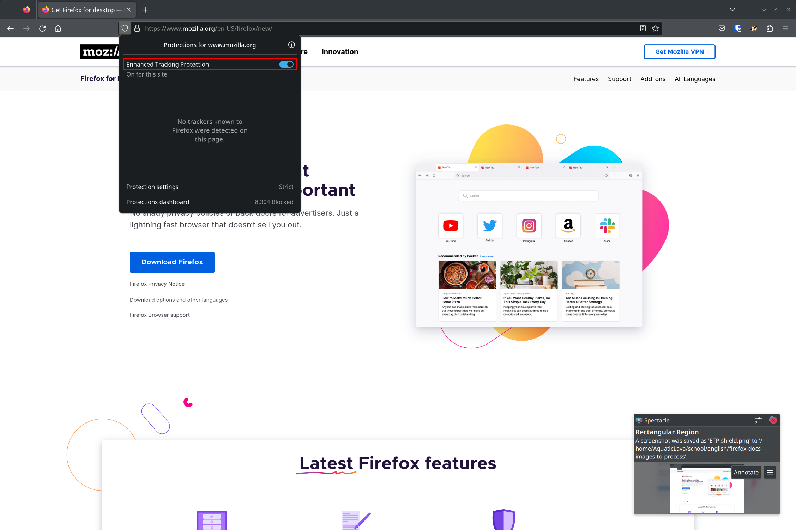

# Privacy-and-security

## What this documentation assumes that you know

- Cookies
- Browsing history
- Download history
- Search history
- Cache

## Getting to your Firefox privacy settings

### Using the GUI
1. click on the hamburger menu on the top right of Firefox.
2. click on Settings

3. Click on the Privacy & Security option in the left side navigation.

### Using the search bar
1. type about:preferences into the search bar.

2. Click on the Privacy & Security option in the left side navigation.

## Firefox default privacy features

### Enhanced Tracking Protection
Enhanced Tracking Protection is in Standard mode.
standard mode blocks the following

- [Social Media Trackers](#social-media-tracker)
- [Cross-site cookies](#cross-site-cookie)
- [Tracking content](#tracking-content) in Private Windows
- [Cryptominers](#cryptominer)
- [Fingerprinters](#fingerprinting)
- [do not track](#do-not-track) is active in private windows

### Do not track
Active in private windows.

### Password management
Firefox has a built in password manager it can:

- auto-fill logins, passwords, addresses, and credit card information
- generate strong passwords
- Firefox relay [email masks](#email-masks)
- alerts if a website you visit has had a password breach

## Easy changes for more privacy

### Enhanced Tracking Protection - Strict Mode.

Setting Enhanced Tracking Protection to Strict mode blocks the following:

- [Social Media Trackers](#social-media-tracker)
- [Cross-site cookies](#cross-site-cookie)
- [Tracking content](#tracking-content)
- [Cryptominers](#cryptominer)
- known and suspected [Fingerprinters](#fingerprinting)
- [do not track](#do-not-track) will always be enabled

Blocking tracking content can cause websites to not work properly. For example if a video has a tracker in it then it will be blocked.

<figure>

<figcaption align = "center">Blocked video on canvas using Kaltura</figcaption>
</figure>

If you encounter a website that isn't working look at the [troubleshooting section](#troubleshooting)

### Enabling Enhanced Tracking Protection - Strict Mode

1. [Navigate to your privacy settings](#getting-to-your-firefox-privacy-settings)
2. Click the Strict Mode option in Enhanced Tracking Protection

### Do not track

If you are not using strict mode, where it is always enabled, you can enable [do not track](#do-not-track)

### Enabling Do not track

1. [Navigate to your privacy settings](#getting-to-your-firefox-privacy-settings)
2. Click the always send do not track signal

### History

Here you can automatically clear data when you close firefox. The data you can clear is:

- Browsing and download history
- [Active logins](#active-logins)
- [Form](#form-history) and search history
- cookies
- cache
- [site settings](#site-settings)
- [Offline website data](#offline-website-data)

### Enable automatic history clearing

1. [Navigate to your privacy settings](getting-to-your-firefox-privacy-settings)
2. check the Clear history when firefox closes box

3. click the settings button

4. check the data you want to have cleared when firefox is closed.

## Troubleshooting

What to do if a website is not working

1. Click on the Shield Icon

2. Click on the Enhanced Tracking Protection toggle

## Definitions

### Social Media Tracker
social media trackers are typically buttons that social media companies encourage web developers to put on there websites to share the article on the companies social media website. They can be used by the social media company to track what websites you visit.

<figure>

<figcaption align = "center">Taken on blog.google</figcaption>
</figure>

### Cross-site cookie
Cross-site cookies are simply cookies that were put on your computer from a different website then the one you are currently at.

For example you could visit Google.com and they can leave a cookie to identify you. Then if you visit a different website who uses googles advertising network, google can look at that cookie and identify you on a different website. Given the amount of websites that use google ads this could allow google track many of the websites you visit!

### Tracking content
Tracking content is general content that can track you.

- ads 
- login fields
- forms
- payments
- comments
- videos
- photos
- buttons

### Cryptominer
Cryptominers are JavaScript applications in a website that will use your CPU to mine cryptocurrencies.

### Fingerprinting
Fingerprinting is when websites attempt to create a unique profile of its visitors using any information they can gather about the visitors system.

Information that could be used in a fingerprint:

- Screen resolution
- Number of screens
- Fonts installed in OS
- IP address
- time zone
- web browser
- browser plugins
- granted permissions
- browser settings
- video and audio formats available
- keyboard layout
- OS

Given all this information its likely that your set of information will be nearly unique to you. This allows companies to figure out what websites you are visiting without using cross-site cookies.

### Do not track

Sends a http header signalling websites that you don't want to be tracked. Honoring the signal is voluntary, So a website may still track you even with the setting enabled. 

### Active logins

Active logins are a method for websites to automatically log users in. Most websites
use cookies to keep users logged in, as they are usually more secure. Active logins use the HTTP basic authentication scheme. 

### Form history

Form history is how Firefox remembers your username or address details that you have submitted on a website before. Form history can be used across different websites if the input tag has the same name. This is common with username inputs, many websites use username as the input tag name.

<figure>

<figcaption align = "center">Form history in a username field</figcaption>
</figure>

### Site settings

Site settings are settings in Firefox that can be changed per site. A example is level of zoom. If you set your zoom on a website to 80% when you close and reopen Firefox that site will still be set to a 80% zoom. This also includes any site specific permissions, like pop-up blocking exceptions or access to your microphone.

### Offline website data

Small amounts of website data is stored automatically, this is typically for website settings. For large amounts of data Firefox will ask if you want to store the file. For example if you download a video on YouTube.com.

### Email masks

A email mask is a separate email that forwards any mail it receives into your main mail box. If a service starts sending you junk emails then you can shut down the email mask that is only linked to that service. 