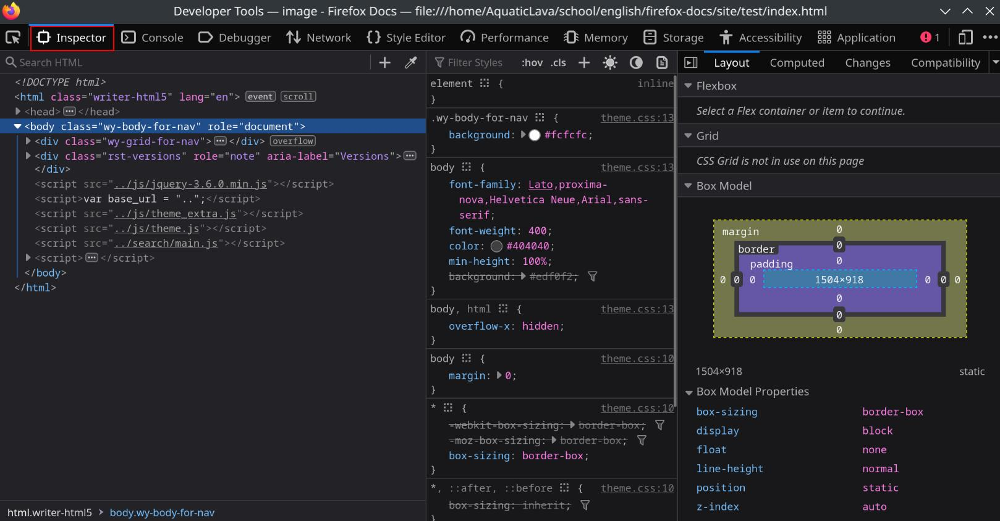

# Style Guide

## Typefaces

*    # Heading 1 : 
    * HTML Tag: `<h1>`
    * Markdown Tag: `# Heading 1`
    * color: `rgb(64, 64, 64)`
    * font-family: `Roboto Slab,ff-tisa-web-pro, Georgia, Arial, sans-serif`
    * font-size: `28px`
    * font-weight: `700`

        
*   ## Heading 2 : 
    * HTML Tag: `<h2>`
    * Markdown Command: `## Heading 2`
    * color: `rgb(64, 64, 64);`
    * font-family: `Roboto Slab, ff-tisa-web-pro, Georgia, Arial, sans-serif;`
    * font-size: `24px;`
    * font-weight: `700`

*   ### Heading 3 : 
    * HTML tag: `<h3>`
    * Markdown command:  `### Heading 3`
    * color: `rgb(64, 64, 64);`
    * font-family: `Roboto Slab,ff-tisa-web-pro Georgia, Arial, sans-serif;`
    * font-size: `20px;`
    * font-weight: `700`

* Normal Text : 
    * HTMl Tag: `
`
    * Markdown Command: `None`
    * color: `rgb(64, 64, 64);`
    * font-family: `Lato, proxima-nova, Helvetica Neue, Arial, sans-serif;`
    * font-size: `16px;`
    * font-weight: `400`

*   **Bold** : 
    * HTML Tag: `<strong> `
    * Markdown Command: `**bold**`
    * color: `rgb(64, 64, 64);`
    * font-family: `Lato, proxima-nova, Helvetica Neue, Arial, sans-serif;`
    * font-size: `16px;`
    * font-weight: `700`
    

*   *Italic* : 
    * HTML Tag: `<em>`
    * Markdown Command: `*Italic*`
    * color: `rgb(64, 64, 64);`
    * font-family: `Lato, proxima-nova, Helvetica Neue, Arial, sans-serif;`
    * font-size: `16px;`
    * font-weight: `400`

## Colors
* ### Main Theme 
    <svg height="100" width="100">
        <circle cx="40" cy="50" r="40" fill="#2980B9" >
    </svg>

    **Theme Blue**

    * To be used only in the header bar of the website
    * Hex: "#2980B9"

    <svg height="100" width="100">
        <circle cx="40" cy="50" r="40" fill="#343131" >
    </svg>

    **Theme Dark Gray**

    * To be used only in the navigation component of the website
    * Hex: "#343131"

    <svg height="100" width="100">
        <circle cx="40" cy="50" r="40" stroke="#343131" stroke-width="1" fill="#FCFCFC" >
    </svg>

    **Theme White**

    * To be used only for the background of pages
    * Hex: "#FCFCFC"

* ### Secondary Theme 

    <svg height="100" width="100">
        <circle cx="40" cy="50" r="40" fill="#EFEFEF" >
    </svg>

    **Secondary Gray**

    * To be used only for the background of secondary components of pages
    * Hex: "#EFEFEF"

    <svg height="100" width="100">
        <circle cx="40" cy="50" r="40" fill="#9B59B6" >
    </svg>

    **Secondary Purple**

    * To be used for main buttons and links
    * Hex: "#9B59B6"

    <svg height="100" width="100">
        <circle cx="40" cy="50" r="40" fill="#272525" >
    </svg>

    **Secondary Dark Gray**

    * To be used for secondary buttons 
    * Hex: "#272525"

# Heading 1

Heading 1 is to be used for section titles. It will show up in the navigation bar
as a top level navigation bar.

## Heading 2

Heading 2 is to be used for breaking up a section into sub-sections. More specifically
Heading 2 can be used to title groups of related content, lists, and images. It will
show up as a nested link in the navigation bar.

### Heading 3

Heading 3 is to be used for setting apart a short section of content, such as titling a list.
Heading 3 should be used sparingly. It will show up as a double nested link in the
navigation bar.

## Unordered Lists

Unordered lists should be used for content that can be itemized but has no specific
ordering. They can be nested, and when they are nested they will be indented and
use a different bullet point style.

- List
    + Sub-item
- Items
- Like 
- This

## Ordered Lists

Ordered lists will use numbers to list out a section of ordered content. They can
be nested, with the nested list using numbers starting back over at 1. Ordered lists
should be used to number steps of procedures.

1. List
    1. sub-item
2. Items
3. Like
4. This

## Images and Screenshots

### images will:
- be taken as screenshots of Firefox
- provide relevant context, the reader should be able to identify the screenshot without previous context.
- Highlights will use a red box of 2px width.
    - example of red box:
    
- Left aligned
- Put in the images folder

## Captions
- Image captions will use the `<figcaption>` html tag.
- Image must be wrapped in a `<figure>` html tag.
- Image must use a `` html tag.
<figure>

<figcaption align = "center">A example image</figcaption>
</figure>

## Voice and Style

Friendly and professional tone.
Language should not be passive