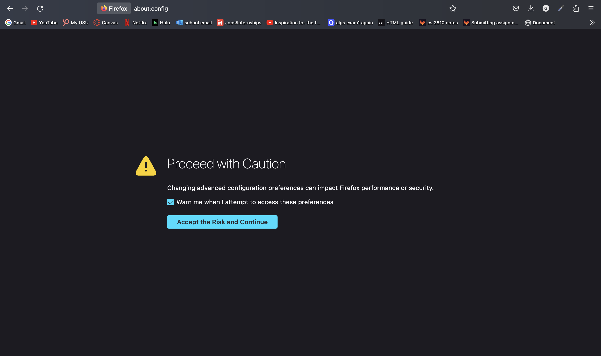

# Theming

Theming in firefox allows users to customize the look of the browser to their liking. In the [Firefox Theme Store](https://firefoxcss-store.github.io/), there is a large selection of themes to choose from

## Selecting a Theme 

Navigate to the [Firefox Theme Store](https://firefoxcss-store.github.io/) and select a desired theme by clicking "download" outlined in red. 

You will then be directed to a separate GitHub page.

## Downloading a Theme

Click the "code" drop down highlighted in red. 

Next, click "download zip" highlighted in red.

Then ensure that the file is in your downloads folder

## Setting Up a Configuration

Next type "about:config" into Firefox's search bar and click "Accept the Risk and Continue"

In about:config paste `toolkit.legacyUserProfileCustomizations.stylesheets` into the search bar. Then click the button highlighted in red to toggle the element to true. 

In about:config paste `layers.acceleration.force-enabled` into the search bar. Then click the button highlighted in red to toggle the element to true. 

In about:config paste `gfx.webrender.all` into the search bar. Then click the button highlighted in red to toggle the element to true. 

In about:config paste `gfx.webrender.enabled` into the search bar. Then click the button highlighted in red to toggle the element to true. 

In about:config paste `layout.css.backdrop-filter.enabled` into the search bar. Then click the button highlighted in red to toggle the element to true. 

In about:config paste `svg.context-properties.content.enabled` into the search bar. Then click the button highlighted in red to toggle the element to true. 

## Applying a Theme

Next open a new tab and enter "about:profiles" into the search bar. You will see the following page: 

Next, under the "default-release" profile and click the "Show In Finder" button in the root directory tab. This will open all files associated with Firefox.

Next open your downloads folder and drag the configuration file downloaded earlier into the firefox folder. 

Then to apply changes, go back to the "about:profiles" tab and click "Restart Normally" highlighted in red. 

